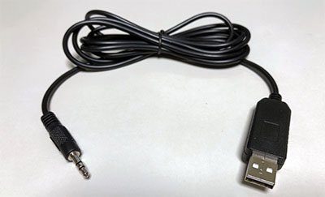

node-bravia-serial-control
===============

The node-bravia-serial-control is a Node.js module which is an implementation of the [Serial Control](https://pro-bravia.sony.net/develop/integrate/rs-232c/index.html) for SONY BRAVIA Professional Displays. You can control BRAVIA Professional Displays from your PC via RS-232C easily using this module.

## Dependencies

* [Node.js](https://nodejs.org/en/) 10 +
* [serialport](https://github.com/serialport/node-serialport) 7.1.5 +

## Installation

```
$ cd ~
$ npm install serialport
$ npm install node-bravia-serial-control
```

---------------------------------------
## Table of Contents

* [Setting BRAVIA](#Setting-BRAVIA)
* [Quick Start](#Quick-Start)
  * [Getting status](#Quick-Start-1)
  * [Changing mode](#Quick-Start-2)
  * [Emulating IR command](#Quick-Start-3)
* [`BraviaSerialControl` object](#BraviaSerialControl-object)
  * [Creating `BraviaSerialControl` object](#Creating-BraviaSerialControl-object)
* [Connection](#BraviaSerialControl-Connection)
  * [`open()` method](#BraviaSerialControl-open-method)
  * [`close()` method](#BraviaSerialControl-close-method)
  * [`isOpen()` method](#BraviaSerialControl-isOpen-method)
  * [`onclose` event handler](#BraviaSerialControl-onclose-event-handler)
* [Power](#BraviaSerialControl-Power)
  * [`getPowerStatus()` method](#BraviaSerialControl-getPowerStatus-method)
  * [`setPowerStatus()` method](#BraviaSerialControl-setPowerStatus-method)
  * [`powerOn()` method](#BraviaSerialControl-powerOn-method)
  * [`powerOff()` method](#BraviaSerialControl-powerOff-method)
  * [`togglePowerStatus()` method](#BraviaSerialControl-togglePowerStatus-method)
  * [`enableStandby()` method](#BraviaSerialControl-enableStandby-method)
  * [`disableStandby()` method](#BraviaSerialControl-disableStandby-method)
* [Input](#BraviaSerialControl-Input)
  * [`getInput()` method](#BraviaSerialControl-getInput-method)
  * [`setInput()` method](#BraviaSerialControl-setInput-method)
* [Audio](#BraviaSerialControl-Audio)
  * [`getAudioVolume()` method](#BraviaSerialControl-getAudioVolume-method)
  * [`setAudioVolume()` method](#BraviaSerialControl-setAudioVolume-method)
  * [`volumeUp()` method](#BraviaSerialControl-volumeUp-method)
  * [`volumeDown()` method](#BraviaSerialControl-volumeDown-method)
  * [`getAudioMute()` method](#BraviaSerialControl-getAudioMute-method)
  * [`setAudioMute()` method](#BraviaSerialControl-setAudioMute-method)
  * [`muteAudio()` method](#BraviaSerialControl-muteAudio-method)
  * [`unmuteAudio()` method](#BraviaSerialControl-unmuteAudio-method)
* [Off Timer](#BraviaSerialControl-Off-Timer)
  * [`setOffTimer()` method](#BraviaSerialControl-setOffTimer-method)
* [Picture Mute](#BraviaSerialControl-Picture-Mute)
  * [`setPictureMute()` method](#BraviaSerialControl-setPictureMute-method)
  * [`mutePicture()` method](#BraviaSerialControl-mutePicture-method)
  * [`unmutePicture()` method](#BraviaSerialControl-unmutePicture-method)
* [Teletext](#BraviaSerialControl-Teletext)
  * [`getTeletext()` method](#BraviaSerialControl-getTeletext-method)
  * [`toggleTeletext()` method](#BraviaSerialControl-toggleTeletext-method)
* [Display](#BraviaSerialControl-Display)
  * [`toggleDisplay()` method](#BraviaSerialControl-toggleDisplay-method)
* [Closed Caption](#BraviaSerialControl-Closed-Caption)
  * [`setClosedCaptionStatus()` method](#BraviaSerialControl-setClosedCaptionStatus-method)
  * [`setClosedCaptionMode()` method](#BraviaSerialControl-setClosedCaptionMode-method)
* [Picture Mode](#BraviaSerialControl-Picture-Mode)
  * [`setPictureMode()` method](#BraviaSerialControl-setPictureMode-method)
* [Contrast](#BraviaSerialControl-Contrast)
  * [`setContrast()` method](#BraviaSerialControl-setContrast-method)
  * [`contrastUp()` method](#BraviaSerialControl-contrastUp-method)
  * [`contrastDown()` method](#BraviaSerialControl-contrastDown-method)
* [Brightness](#BraviaSerialControl-Brightness)
  * [`setBrightness()` method](#BraviaSerialControl-setBrightness-method)
  * [`brightnessUp()` method](#BraviaSerialControl-brightnessUp-method)
  * [`brightnessDown()` method](#BraviaSerialControl-brightnessDown-method)
* [Saturation](#BraviaSerialControl-Saturation)
  * [`setSaturation()` method](#BraviaSerialControl-setSaturation-method)
  * [`saturationUp()` method](#BraviaSerialControl-saturationUp-method)
  * [`saturationDown()` method](#BraviaSerialControl-saturationDown-method)
* [Hue](#BraviaSerialControl-Hue)
  * [`hueUp()` method](#BraviaSerialControl-hueUp-method)
  * [`hueDown()` method](#BraviaSerialControl-hueDown-method)
* [Sharpness](#BraviaSerialControl-Sharpness)
  * [`setSharpness()` method](#BraviaSerialControl-setSharpness-method)
  * [`sharpnessUp()` method](#BraviaSerialControl-sharpnessUp-method)
  * [`sharpnessDown()` method](#BraviaSerialControl-sharpnessDown-method)
* [Cine Motion (Cinema Drive)](#BraviaSerialControl-Cine-Motion)
  * [`setCineMotionStatus()` method](#BraviaSerialControl-setCineMotionStatus-method)
* [Sound](#BraviaSerialControl-Sound)
  * [`setSoundMode()` method](#BraviaSerialControl-setSoundMode-method)
  * [`setSpeakerStatus()` method](#BraviaSerialControl-setSpeakerStatus-method)
* [Screen](#BraviaSerialControl-Screen)
  * [`shiftScreenPosition()` method](#BraviaSerialControl-shiftScreenPosition-method)
  * [`setScreenWideMode()` method](#BraviaSerialControl-setScreenWideMode-method)
  * [`setScreenAutoWideStatus()` method](#BraviaSerialControl-setScreenAutoWideStatus-method)
  * [`setScreen4To3Mode()` method](#BraviaSerialControl-setScreen4To3Mode-method)
* [SIRCS](#BraviaSerialControl-SIRCS)
  * [`emulateSircs()` method](#BraviaSerialControl-emulateSircs-method)
* [Signage](#BraviaSerialControl-Signage)
  * [`getSignageInfo()` method](#BraviaSerialControl-getSignageInfo-method)
* [Release Note](#Release-Note)
* [References](#References)
* [License](#License)

---------------------------------------
## <a id="Setting-BRAVIA">Setting BRAVIA</a>

BRAVIA Professional Display has a serial port. But the connector is not D-sub which is widely used. It is 3.5 mm stereo mini jack. I personally recommend to use a USB-to-pin-jack TTL Serial Adapter Converter Cable (FTDI chip) to connect your PC and BRAVIA.



The BRAVIA [Serial Control](https://pro-bravia.sony.net/develop/integrate/rs-232c/index.html) is disabled by default. Before you use this module, you have to enable the BRAVIA Serial Control. Visit the [official page](https://pro-bravia.sony.net/develop/integrate/rs-232c/getting-started/index.html), see the section "Set up BRAVIA Professional Display" for details.

---------------------------------------
## <a id="Quick-Start">Quick Start</a>

### <a id="Quick-Start-1">Getting status</a>

The BRAVIA Serial Control enables you to retrieve some status or setting modes. The sample code below retrieves the power status of the BRAVIA.

```javascript
// BraviaSerialControl constructor
const BraviaSerialControl = require('node-bravia-serial-control');
// BraviaSerialControl object
const bravia = new BraviaSerialControl({ path: '/dev/ttyUSB0' });

// Open the serial port
bravia.open().then(() => {
  console.log('Opened.');
  // Retreive the power status
  return bravia.getPowerStatus();
}).then((res) => {
  // Show the result
  console.log(JSON.stringify(res, null, '  '));
  // Close the serial port
  return bravia.close();
}).then(() => {
  console.log('Closed.');
}).catch((error) => {
  console.error(error);
});
```

 In the code above, the variable `bravia` is a [`BraviaSerialControl`](#BraviaSerialControl-object) object. you can retrieve the status calling the [`getPowerStatus()`](#BraviaSerialControl-getPowerStatus-method) method implemented in the [`BraviaSerialControl`](#BraviaSerialControl-object) object.

The code above will output the result as follows:

```
Opened.
{
  "status": false
}
Closed.
```

As you can see the code above, you have to open the serial port using the [`open()`](#BraviaSerialControl-open-method) method before accessing the BRAVIA.

### <a id="Quick-Start-2">Changing mode</a>

The BRAVIA Serial Control allows you to change various types of status or mode of the BRAVIA. For example, you can change the picture mode using the [`setPictureMode()`]((#BraviaSerialControl-setPictureMode-method)) method:

```JavaScript
// BraviaSerialControl constructor
const BraviaSerialControl = require('node-bravia-serial-control');
// BraviaSerialControl object
const bravia = new BraviaSerialControl({ path: '/dev/ttyUSB0' });

// Open the serial port
bravia.open().then(() => {
  console.log('Opened.');
  // Set the picture mode to "cinema"
  return bravia.setPictureMode({ mode: 'cinema' });
}).then(() => {
  // Show the result
  console.log('Done.');
  // Close the serial port
  return bravia.close();
}).then(() => {
  console.log('Closed.');
}).catch((error) => {
  console.error(error);
});
```

### <a id="Quick-Start-3">Emulating IR command</a>

The BRAVIA Serial Control supports the SIRCS (Sony IR Control System) emulation. That is, you can emulate IR commands using this module.

```JavaScript
// BraviaSerialControl constructor
const BraviaSerialControl = require('node-bravia-serial-control');
// BraviaSerialControl object
const bravia = new BraviaSerialControl({ path: '/dev/ttyUSB0' });

// Open the serial port
bravia.open().then(() => {
  console.log('Opened.');
  // Emulate the CC (Closed Caption) button on the remote
  return bravia.emulateSircs({ code: 'cc' });
}).then(() => {
  // Show the result
  console.log('Done.');
  // Close the serial port
  return bravia.close();
}).then(() => {
  console.log('Closed.');
}).catch((error) => {
  console.error(error);
});
```

---------------------------------------
## <a id="BraviaSerialControl-object">`BraviaSerialControl` object</a>

### <a id="Creating-BraviaSerialControl-object">Creating `BraviaSerialControl` object</a>

In order to use this module , you have to get the `BraviaSerialControl` constructor loading this module, then create a `BraviaSerialControl` object from the constructor as follows:

```JavaScript
// BraviaSerialControl constructor
const BraviaSerialControl = require('node-bravia-serial-control');
// BraviaSerialControl object
const bravia = new BraviaSerialControl({ path: '/dev/ttyUSB0' });
```

In the code snippet above, the variable `bravia` is a `BraviaSerialControl` object. The `BraviaSerialControl` object has a variety of methods for controlling the BRAVIA as described in sections below.

The constructor takes a hash object containing the properties as follows:

Property   | Type    | Required | Description
:----------|:--------|:---------|:-------------------
`path`     | String  | Required | The identifier of the serial port (e.g., "/dev/ttyUSB0", "COM3")
`interval` | Integer | Optional | Command interval (msec). The value must be an integer in the range of 0 to 1000. The default value is 500 (msec).

The BRAVIA Serial Control spec says that "Set the command interval to at least 500 ms.". This module automatically handles the constraint. Basically, you don't have to care about the constraint. For example, chaining promises below works well:

```javascript
// Open the serial port
bravia.open().then(() => {
  console.log('Opened.');
  // Change the external input to "TV"
  return bravia.setInput({ type: 'tv', port: 1 });
}).then(() => {
  // Set the brightness to 50
  return bravia.setBrightness({ value: 50 });
}).then(() => {
  // Change the picture mode to "cinema"
  return bravia.setPictureMode({ mode: 'cinema' });
}).then(() => {
  // Emulate the CC (Closed Caption) button on the remote
  return bravia.emulateSircs({ code: 'cc' });
}).then(() => {
  // Power off
  return bravia.powerOff();
}).then(() => {
  // Show the result
  console.log('Done.');
  // Close the serial port
  return bravia.close();
}).then(() => {
  console.log('Closed.');
}).catch((error) => {
  console.error(error);
});
```

Actually, BRAVIAs of recent years might work well even if the interval is shorter than 500 msec. At least, my own BRAVIA worked well even if the `interval` was set to 0. (The model of my own BRAVIA is KJ-43X8300D which started to be sold from 2016 in Japan.)

```javascript
const bravia = new BraviaSerialControl({ path: '/dev/ttyUSB0', interval: 0 });
```

---------------------------------------
## <a id="BraviaSerialControl-Connection">Connection</a>

### <a id="BraviaSerialControl-open-method">`open()` method</a>

The `open` method opens the serial port and establishes a connection with the BRAVIA. This method returns a `Promise` object. Nothing will be passed to the `resolve()`.

```javascript
bravia.open().then(() => {
  console.log('Opened.');
});
```

Note that you have to open the serial port using this method before calling the methods described in the sections below. This module does not automatically open the port.

### <a id="BraviaSerialControl-close-method">`close()` method</a>

The `close` method closes the serial port. This method returns a `Promise` object. Nothing will be passed to the `resolve()`.

```javascript
bravia.close().then(() => {
  console.log('Closed.');
});
```

### <a id="BraviaSerialControl-isOpen-method">`isOpen()` method</a>

The `isOpen()` method returns the connection status. If the serial port is open, this method returns `true`. Otherwise, this method returns `false`.


### <a id="BraviaSerialControl-onclose-event-handler">`onclose` event handler</a>

The `onclose` event handler will be called when the connection was closed.

```javascript
bravia.onclose = (event) => {
  console.log(JSON.stringify(event, null, '  '));
}
```
An object containing the information of the event will be passed to the callback function as follows:

* When the connection was closed by the [`close()`](#BraviaSerialControl-close-method) method:

```json
{
 "intentional": true
}
```

* When the connection was closed unexpectedly:

```json
{
 "intentional": false
}
```

---------------------------------------
## <a id="BraviaSerialControl-Power">Power</a>

### <a id="BraviaSerialControl-getPowerStatus-method">`getPowerStatus()` method</a>

The `getPowerStatus()` method retrieves the power status of the BRAVIA. This method returns a Promise object.

If the information is fetched successfully, a hash object containing the information will be passed to the `resolve()` function. The hash object has the properties as follows:

Property	| Type	  | Description
:---------|:--------|:------------------------
`status`  | Boolean | `true`: Active (On), `false`: Standby (Off)

```javascript
bravia.getPowerStatus()..then((res) => {
  console.log(JSON.stringify(res, null, '  '));
});
```

The code above will output the result as follows:

```json
{
  "status": true
}
```

### <a id="BraviaSerialControl-setPowerStatus-method">`setPowerStatus()` method</a>

The `setPowerStatus()` method changes the power status of the BRAVIA. This method returns a Promise object.

*Note that you have to enable the StandBy mode of the BRAVIA using the [`enableStandby()`](#BraviaSerialControl-enableStandby-method) method in advance.*

This method takes a hash object as an argument containing properties as follows:

Property	| Type	  | Required | Description
:---------|:--------|:---------|:----------------------
`status`  | Boolean | Optional | `true`: Active (On), `false`: Standby (Off)

If the `status` is not specified, this method toggles the power status. That is, if the BRAVIA is turned on, this method turns it off, and vice versa.

```javascript
bravia.setPowerStatus({ status: false }).then((res) => {
  console.log(JSON.stringify(res, null, '  '));
});
```

If this method was executed successfully, a hash object will be passed to the `resolve()` function. The hash object has the properties as follows:

Property	| Type	  | Description
:---------|:--------|:------------------------
`status`  | Boolean | `true`: Active (On), `false`: Standby (Off)

The code above will output the result as follows:

```json
{
  "status": false
}
```

### <a id="BraviaSerialControl-powerOn-method">`powerOn()` method</a>

The `powerOn()` method turns on the BRAVIA. This method returns a Promise object.

*Note that you have to enable the StandBy mode of the BRAVIA using the [`enableStandby()`](#BraviaSerialControl-enableStandby-method) method in advance.*

```javascript
bravia.powerOn()..then((res) => {
  console.log(JSON.stringify(res, null, '  '));
});
```

If this method was executed successfully, a hash object will be passed to the `resolve()` function. The hash object has the properties as follows:

Property	| Type	  | Description
:---------|:--------|:------------------------
`status`  | Boolean | This property always returns `true` which means Active (On).

The code above will output the result as follows:

```json
{
  "status": true
}
```

This method is equivalent to the code below:

```javascript
bravia.setPowerStatus({ status: true })
```

### <a id="BraviaSerialControl-powerOff-method">`powerOff()` method</a>

The `powerOff()` method turns off the BRAVIA. This method returns a Promise object.

```javascript
bravia.powerOff().then((res) => {
  console.log(JSON.stringify(res, null, '  '));
});
```

If this method was executed successfully, a hash object will be passed to the resolve() function. The hash object has the properties as follows:

Property	| Type	  | Description
:---------|:--------|:------------------------
`status`  | Boolean | This property always returns `false` which means Standby (Off).

The code above will output the result as follows:

```json
{
  "status": false
}
```

This method is equivalent to the code below:

```javascript
bravia.setPowerStatus({ status: false })
```

### <a id="BraviaSerialControl-togglePowerStatus-method">`togglePowerStatus()` method</a>

The `togglePowerStatus()` method toggles the power status of the BRAVIA like the power button on the remote. That is, if the BRAVIA is turned on, this method turns it off, and vice versa. This method returns a Promise object.

*Note that you have to enable the StandBy mode of the BRAVIA using the [`enableStandby()`](#BraviaSerialControl-enableStandby-method) method in advance.*

```javascript
bravia.togglePowerStatus().then((res) => {
  console.log(JSON.stringify(res, null, '  '));
});
```

If this method was executed successfully, a hash object will be passed to the `resolve()` function. The hash object has the properties as follows:

Property	| Type	  | Description
:---------|:--------|:------------------------
`status`  | Boolean | `true`: Active (On), `false`: Standby (Off)

The code above will output the result as follows:

```json
{
  "status": true
}
```

This method is equivalent to the code below:

```javascript
bravia.setPowerStatus()
```


### <a id="BraviaSerialControl-enableStandby-method">`enableStandby()` method</a>

The `enableStandby()` method enables the StandBy mode of the BRAVIA. This method returns a Promise object.

The StandBy mode is disabled by default. If you want to turn on the BRAVIA using the [`setPowerStatus()`](#BraviaSerialControl-setPowerStatus-method), [`powerOn()`](#BraviaSerialControl-powerOn-method), and the [`togglePowerStatus()`](#BraviaSerialControl-togglePowerStatus-method) methods, you have to enable the StandBy mode in advance.

```javascript
bravia.enableStandby().then((res) => {
  console.log('Done.');
});
```

### <a id="BraviaSerialControl-disableStandby-method">`disableStandby()` method</a>

The `disableStandby()` method disables the StandBy mode of the BRAVIA. This method returns a Promise object.

```javascript
bravia.disableStandby().then((res) => {
  console.log('Done.');
});
```

---------------------------------------
## <a id="BraviaSerialControl-Input">Input</a>

### <a id="BraviaSerialControl-getInput-method">`getInput()` method</a>

The `getInput()` method retrieves the current selected external input. This method returns a Promise object.

If the information is fetched successfully, a hash object containing the information will be passed to the resolve() function. The hash object has the properties as follows:

Property	| Type	  | Description
:---------|:--------|:------------------------
`type`    | String  |`"tv"`, `"video"`, `"component"`, `"hdmi"`, `"pc"`, or `"shared"`
`port`    | Integer | Port number

```javascript
bravia.getInput().then((res) => {
  console.log(JSON.stringify(res, null, '  '));
});
```

The code above will output the result as follows:

```json
{
  "type": "hdmi",
  "port": 2
}
```

When the `type` is `"tv"`, the value of the `"port"` does not seem to be a channel number. The BRAVIA Serial Control specification does not provide any information about that.

### <a id="BraviaSerialControl-setInput-method">`setInput()` method</a>

The `setInput()` method changes the current selected external input. This method returns a `Promise` object. Nothing will be passed to the resolve().

This method takes a hash object as an argument containing properties as follows:

Property	| Type	  | Required | Description
:---------|:--------|:---------|:----------------------
`type`    | String  | Required | `"tv"`, `"video"`, `"component"`, `"hdmi"`, `"pc"`, or `"shared"`
`port`    | Integer | Required | 1 - 5 (The maximum number depends on the `type`)

If the `type` is set to `"tv"`, the value of `port` must be 1.

Note that the BRAVIA does not return any error even if a type that the BRAVIA does not support is specified.

```javascript
bravia.setInput({ type: 'hdmi', port: 1 }).then((res) => {
  console.log('Done.');
});
```


---------------------------------------
## <a id="BraviaSerialControl-Audio">Audio</a>

### <a id="BraviaSerialControl-getAudioVolume-method">`getAudioVolume()` method</a>

The `getAudioVolume()` method retrieves the level of the audio volume. This method returns a `Promise` object.

If the information is fetched successfully, a hash object containing the information will be passed to the `resolve()` function. The hash object has the properties as follows:

Property	| Type	  | Description
:---------|:--------|:------------------------
`volume`  | Integer | Current audio volume level. The value may be in the range of 0 to 100. The max value depends on your BRAVIA.

```javascript
bravia.getAudioVolume().then((res) => {
  console.log(JSON.stringify(res, null, '  '));
});
```

The code above will output the result as follows:

```json
{
  "volume": 20
}
```

### <a id="BraviaSerialControl-setAudioVolume-method">`setAudioVolume()` method</a>

The `setAudioVolume()` method changes the level of the audio volume. This method returns a `Promise` object.

This method takes a hash object as an argument containing properties as follows:

Property	| Type	  | Required | Description
:---------|:--------|:---------|:----------------------
`volume`  | Integer | Required | Audio volume level (0 - 100). The max value depends on your BRAVIA.

```javascript
bravia.setAudioVolume({ volume: 5 }).then((res) => {
  console.log(JSON.stringify(res, null, '  '));
});
```

If this method was executed successfully, a hash object will be passed to the `resolve()` function. The hash object has the properties as follows:

Property	| Type	  | Description
:---------|:--------|:------------------------
`volume`  | Integer | Audio volume level (0 - 100). The max value depends on your BRAVIA.

The code above will output the result as follows:

```json
{
  "volume": 5
}
```

### <a id="BraviaSerialControl-volumeUp-method">`volumeUp()` method</a>

The `volumeUp()` method turns up the audio volume the specified steps. This method returns a `Promise` object.

This method takes a hash object as an argument containing properties as follows:

Property	| Type	  | Required | Description
:---------|:--------|:---------|:----------------------
`step`    | Integer | Optional | 1 - 100 (Default: 1)

```javascript
bravia.volumeUp({ step: 5 }).then((res) => {
  console.log(JSON.stringify(res, null, '  '));
});
```

If this method was executed successfully, a hash object will be passed to the resolve() function. The hash object has the properties as follows:

Property	| Type	  | Description
:---------|:--------|:------------------------
`volume`  | Integer | Audio volume level (0 - 100). The max value depends on your BRAVIA.

The code above will output the result as follows:

```json
{
  "volume": 25
}
```

If the sum of the current level and the specified step is grater than the maximum level, The BRAVIA seems to set the volume level to the maximum level. (At least, my own BRAVIA does so.)

### <a id="BraviaSerialControl-volumeDown-method">`volumeDown()` method</a>

The `volumeDown()` method turns down the audio volume the specified steps. This method returns a `Promise` object.

This method takes a hash object as an argument containing properties as follows:

Property	| Type	  | Required | Description
:---------|:--------|:---------|:----------------------
`step`    | Integer | Optional | 1 - 100 (Default: 1)

```javascript
bravia.volumeDown({ step: 5 }).then((res) => {
  console.log(JSON.stringify(res, null, '  '));
});
```

If this method was executed successfully, a hash object will be passed to the resolve() function. The hash object has the properties as follows:

Property	| Type	  | Description
:---------|:--------|:------------------------
`volume`  | Integer | Audio volume level (0 - 100). The max value depends on your BRAVIA.

The code above will output the result as follows:

```json
{
  "volume": 20
}
```

If the current level minus the specified step is less than 0, the BRAVIA seems to set the volume level to 0. (At least, my own BRAVIA does so.)

### <a id="BraviaSerialControl-getAudioMute-method">`getAudioMute()` method</a>

The `getAudioMute()` method retrieves the audio mute status. This method returns a `Promise` object.

If the information is fetched successfully, a hash object containing the information will be passed to the `resolve()` function. The hash object has the properties as follows:

Property	| Type	  | Description
:---------|:--------|:------------------------
`status`  | Boolean | `true`: Muted, `false`: Unmuted

```javascript
bravia.getAudioMute().then((res) => {
  console.log(JSON.stringify(res, null, '  '));
});
```

The code above will output the result as follows:

```json
{
  "status": false
}
```

### <a id="BraviaSerialControl-setAudioMute-method">`setAudioMute()` method</a>

The `setAudioMute()` method changes the audio mute status of the BRAVIA. This method returns a `Promise` object. Nothing will be passed to the `resolve()`.

This method takes a hash object as an argument containing properties as follows:

Property	| Type	  | Required | Description
:---------|:--------|:---------|:----------------------
`status`  | Boolean | Optional | `true`: Mute, `false`: Unmute

If the `status` is not specified, this method toggles the status.

```javascript
bravia.setAudioMute({ status: true }).then((res) => {
  console.log(JSON.stringify(res, null, '  '));
});
```

### <a id="BraviaSerialControl-muteAudio-method">`muteAudio()` method</a>

The `muteAudio()` method mutes audio. This method returns a `Promise` object. Nothing will be passed to the `resolve()`.

```javascript
bravia.muteAudio().then(() => {
  console.log('Done.');
});
```
This method is equivalent to the code below:

```javascript
this.setAudioMute({ status: true });
```

### <a id="BraviaSerialControl-unmuteAudio-method">`unmuteAudio()` method</a>

The `unmuteAudio()` method unmutes audio. This method returns a `Promise` object. Nothing will be passed to the `resolve()`.

```javascript
bravia.unmuteAudio().then(() => {
  console.log('Done.');
});
```

This method is equivalent to the code below:

```javascript
this.setAudioMute({ status: false });
```

---------------------------------------
## <a id="BraviaSerialControl-Off-Timer">Off Timer</a>

### <a id="BraviaSerialControl-setOffTimer-method">`setOffTimer()` method</a>

The `setOffTimer()` method sets the off (sleep) timer. This method returns a `Promise` object. Nothing will be passed to the `resolve()`.

This method takes a hash object as an argument containing properties as follows:

Property	| Type	  | Required | Description
:---------|:--------|:---------|:----------------------
`offset`  | Integer | Required | 0 - 255 (minites)

The maximum value of the `offset` depends on your BRAVIA.

```javascript
bravia.setOffTimer({ offset: 30 }).then(() => {
  console.log('Done.');
});
```

If you want to cancel the off timer, set the `offset` to `0`.

```javascript
bravia.setOffTimer({ offset: 0 }).then(() => {
  console.log('Done.');
});
```

---------------------------------------
## <a id="BraviaSerialControl-Picture-Mute">Picture Mute</a>

### <a id="BraviaSerialControl-setPictureMute-method">`setPictureMute()` method</a>

The `setPictureMute()` method changes the status of the picture mute. This method returns a `Promise` object. Nothing will be passed to the `resolve()`.

This method takes a hash object as an argument containing properties as follows:

Property	| Type	  | Required | Description
:---------|:--------|:---------|:----------------------
`status`  | Boolean | Optional | `true`: Mute, `false`: Unmute

If the `status` is not specified, this method toggles the status.

```javascript
bravia.setPictureMute({ status: true }).then(() => {
  console.log('Done.');
});
```

### <a id="BraviaSerialControl-mutePicture-method">`mutePicture()` method</a>

The `mutePicture()` method mutes picture. This method returns a `Promise` object. Nothing will be passed to the `resolve()`.

```javascript
bravia.mutePicture().then(() => {
  console.log('Done.');
});
```

This method is equivalent to the code below:

```javascript
this.setPictureMute({ status: true });
```

### <a id="BraviaSerialControl-unmutePicture-method">`unmutePicture()` method</a>

The `unmutePicture()` method unmutes picture. This method returns a `Promise` object. Nothing will be passed to the `resolve()`.

```javascript
bravia.unmutePicture().then(() => {
  console.log('Done.');
});
```

This method is equivalent to the code below:

```javascript
this.setPictureMute({ status: false });
```

---------------------------------------
## <a id="BraviaSerialControl-Teletext">Teletext</a>

### <a id="BraviaSerialControl-getTeletext-method">`getTeletext()` method</a>

*This method possibly does not work well on your BRAVIA. At least, my own BRAVIA returns an error.*

The `getTeletext()` method retrieves the current teletext mode. This method returns a `Promise` object.

If the information is fetched successfully, a hash object containing the information will be passed to the `resolve()`. The hash object has the properties as follows:

Property	| Type	  | Description
:---------|:--------|:------------------------
`mode`    | String  |`"off"`, `"text"`, `"mix"` (MIX-Text )

```javascript
bravia.getTeletext().then((res) => {
  console.log(JSON.stringify(res, null, '  '));
});
```

The code above will output the result as follows:

```json
{
  "mode": "text"
}
``` 

### <a id="BraviaSerialControl-toggleTeletext-method">`toggleTeletext()` method</a>

*This method possibly does not work well on your BRAVIA. At least, my own BRAVIA returns an error.*

The `toggleTeletext()` method toggles the teletext mode. This method returns a `Promise` object. Nothing will be passed to the `resolve()`.

```javascript
bravia.toggleTeletext().then((res) => {
  console.log(JSON.stringify(res, null, '  '));
});
```

---------------------------------------
## <a id="BraviaSerialControl-Display">Display</a>

### <a id="BraviaSerialControl-toggleDisplay-method">`toggleDisplay()` method</a>

The `toggleDisplay()` method toggles the status whether the current TV channel information is shown or hidden on the screen. This method acts like you press the display (info) key on the remote. This method returns a `Promise` object. Nothing will be passed to the `resolve()`.

```javascript
bravia.toggleDisplay().then(() => {
  console.log('Done.');
});
```

---------------------------------------
## <a id="BraviaSerialControl-Closed-Caption">Closed Caption</a>

### <a id="BraviaSerialControl-setClosedCaptionStatus-method">`setClosedCaptionStatus()` method</a>

The `setClosedCaptionStatus()` method changes the closed caption status. This method returns a `Promise` object. Nothing will be passed to the `resolve()`.

This method takes a hash object as an argument containing properties as follows:

Property	| Type	  | Required | Description
:---------|:--------|:---------|:----------------------
`status`  | Boolean | Optional | `true`: ON, `false`: OFF

If the `status` is not specified, this method toggles the status.

```javascript
bravia.setClosedCaptionStatus({ status: true }).then(() => {
  console.log('Done.');
});
```

*This method possibly does not work well on your BRAVIA. At least, my own BRAVIA accepts the toggle command, but does not accept the ON/OFF command.*

### <a id="BraviaSerialControl-setClosedCaptionMode-method">`setClosedCaptionMode()` method</a>

The `setClosedCaptionMode()` method changes the closed caption mode. This method returns a `Promise` object. Nothing will be passed to the `resolve()`.

This method takes a hash object as an argument containing properties as follows:

Property	| Type	  | Required | Description
:---------|:--------|:---------|:----------------------
`type`    | String  | Required | `"analog"` or `"digital"`
`mode`    | String  | Required |  See the description blow.

If the `type` is `"analog"`, the possible values of the `mode` are:

* `cc1`
* `cc2`
* `cc3`
* `cc4`
* `text1`
* `text2`
* `text3`
* `text4`

If the `type` is `"digital"`, the possible values of the `mode` are:

* `service1`
* `service2`
* `service3`
* `service4`
* `service5`
* `service6`
* `cc1`
* `cc2`
* `cc3`
* `cc4`

*The actual acceptable value of the `mode` depends on your BRAVIA.*

```javascript
bravia.setClosedCaptionMode({ type: 'digital', mode: 'cc1' }).then(() => {
  console.log('Done.');
});
```

*This method possibly does not work well on your BRAVIA. At least, my own BRAVIA acts as if the command is accepted, but nothing is changed.*

---------------------------------------
## <a id="BraviaSerialControl-Picture-Mode">Picture Mode</a>

### <a id="BraviaSerialControl-setPictureMode-method">`setPictureMode()` method</a>

The `setPictureMode()` method changes the picture mode. This method returns a `Promise` object. Nothing will be passed to the `resolve()`.

This method takes a hash object as an argument containing properties as follows:

Property	| Type	  | Required | Description
:---------|:--------|:---------|:----------------------
`mode`    | String  | Required |  See the description blow.

The possible values of the `mode` are:

* `vivid`
* `standard`
* `cinema`
* `custom`
* `cine2`
* `sports`
* `game`
* `graphic`


```javascript
bravia.setPictureMode({ mode: 'cinema' }).then(() => {
  console.log('Done.');
});
```

---------------------------------------
## <a id="BraviaSerialControl-Contrast">Contrast</a>

### <a id="BraviaSerialControl-setContrast-method">`setContrast()` method</a>

The `setContrast()` method changes the contrast. This method returns a `Promise` object. Nothing will be passed to the `resolve()`.

This method takes a hash object as an argument containing properties as follows:

Property	| Type	  | Required | Description
:---------|:--------|:---------|:----------------------
`value`   | Integer | Required | 0 - 100

The actual maximum value of the `value` depends on your BRAVIA.

```javascript
bravia.setContrast({ value: 50 }).then(() => {
  console.log('Done.');
});
```

### <a id="BraviaSerialControl-contrastUp-method">`contrastUp()` method</a>

The `contrastUp()` method increases the contrast one step. This method returns a `Promise` object. Nothing will be passed to the `resolve()`.

```javascript
bravia.contrastUp().then((res) => {
  console.log('Done.');
});
```

### <a id="BraviaSerialControl-contrastDown-method">`contrastDown()` method</a>

The `contrastDown()` method decrease the contrast one step. This method returns a `Promise` object. Nothing will be passed to the `resolve()`.

```javascript
bravia.contrastDown().then((res) => {
  console.log('Done.');
});
```

---------------------------------------
## <a id="BraviaSerialControl-Brightness">Brightness</a>

### <a id="BraviaSerialControl-setBrightness-method">`setBrightness()` method</a>

The `setBrightness()` method changes the brightness. This method returns a `Promise` object. Nothing will be passed to the `resolve()`.

This method takes a hash object as an argument containing properties as follows:

Property	| Type	  | Required | Description
:---------|:--------|:---------|:----------------------
`value`   | Integer | Required | 0 - 100

The actual maximum value of the `value` depends on your BRAVIA. My own BRAVIA accepts up to 50.

```javascript
bravia.setBrightness({ value: 50 }).then(() => {
  console.log('Done.');
});
```

### <a id="BraviaSerialControl-brightnessUp-method">`brightnessUp()` method</a>

The `brightnessUp()` method increases the brightness one step. This method returns a `Promise` object. Nothing will be passed to the `resolve()`.

```javascript
bravia.brightnessUp().then((res) => {
  console.log('Done.');
});
```

### <a id="BraviaSerialControl-brightnessDown-method">`brightnessDown()` method</a>

The `brightnessDown()` method decrease the brightness one step. This method returns a `Promise` object. Nothing will be passed to the `resolve()`.

```javascript
bravia.brightnessDown().then((res) => {
  console.log('Done.');
});
```

---------------------------------------
## <a id="BraviaSerialControl-Saturation">Saturation</a>

### <a id="BraviaSerialControl-setSaturation-method">`setSaturation()` method</a>

The `setSaturation()` method changes the saturation. This method returns a `Promise` object. Nothing will be passed to the `resolve()`.

This method takes a hash object as an argument containing properties as follows:

Property	| Type	  | Required | Description
:---------|:--------|:---------|:----------------------
`value`   | Integer | Required | 0 - 100

The actual maximum value of the `value` depends on your BRAVIA.

```javascript
bravia.setSaturation({ value: 60 }).then(() => {
  console.log('Done.');
});
```

### <a id="BraviaSerialControl-saturationUp-method">`saturationUp()` method</a>

The `saturationUp()` method increases the saturation one step. This method returns a `Promise` object. Nothing will be passed to the `resolve()`.

```javascript
bravia.saturationUp().then((res) => {
  console.log('Done.');
});
```

### <a id="BraviaSerialControl-saturationDown-method">`saturationDown()` method</a>

The `saturationDown()` method decrease the saturation one step. This method returns a `Promise` object. Nothing will be passed to the `resolve()`.

```javascript
bravia.saturationDown().then((res) => {
  console.log('Done.');
});
```

---------------------------------------
## <a id="BraviaSerialControl-Hue">Hue</a>

### <a id="BraviaSerialControl-hueUp-method">`hueUp()` method</a>

The `hueUp()` method strengthens the green tone of the hue the specified steps. This method returns a `Promise` object. Nothing will be passed to the `resolve()`.

This method takes a hash object as an argument containing properties as follows:

Property	| Type	  | Required | Description
:---------|:--------|:---------|:----------------------
`step`    | Integer | Optional | 1 - 100 (Default: 1)

```javascript
bravia.hueUp({ step: 5 }).then((res) => {
  console.log('Done.');
});
```

### <a id="BraviaSerialControl-hueDown-method">`hueDown()` method</a>

The `hueDown()` method strengthen the red tone of the hue the specified steps. This method returns a `Promise` object. Nothing will be passed to the `resolve()`.

This method takes a hash object as an argument containing properties as follows:

Property	| Type	  | Required | Description
:---------|:--------|:---------|:----------------------
`step`    | Integer | Optional | 1 - 100 (Default: 1)

```javascript
bravia.hueDown({ step: 5 }).then((res) => {
  console.log('Done.');
});
```

---------------------------------------
## <a id="BraviaSerialControl-Sharpness">Sharpness</a>

### <a id="BraviaSerialControl-setSharpness-method">`setSharpness()` method</a>

The `setSharpness()` method changes the sharpness. This method returns a `Promise` object. Nothing will be passed to the `resolve()`.

This method takes a hash object as an argument containing properties as follows:

Property	| Type	  | Required | Description
:---------|:--------|:---------|:----------------------
`value`   | Integer | Required | 0 - 100

The actual maximum value of the `value` depends on your BRAVIA.

```javascript
bravia.setSharpness({ value: 100 }).then(() => {
  console.log('Done.');
});
```

### <a id="BraviaSerialControl-sharpnessUp-method">`sharpnessUp()` method</a>

The `sharpnessUp()` method increases the sharpness one step. This method returns a `Promise` object. Nothing will be passed to the `resolve()`.

```javascript
bravia.sharpnessUp().then((res) => {
  console.log('Done.');
});
```

### <a id="BraviaSerialControl-sharpnessDown-method">`sharpnessDown()` method</a>

The `sharpnessDown()` method decrease the sharpness one step. This method returns a `Promise` object. Nothing will be passed to the `resolve()`.

```javascript
bravia.sharpnessDown().then((res) => {
  console.log('Done.');
});
```

---------------------------------------
## <a id="BraviaSerialControl-Cine-Motion">Cine Motion (Cinema Drive)</a>

### <a id="BraviaSerialControl-setCineMotionStatus-method">`setCineMotionStatus()` method</a>

The `setCineMotionStatus()` method changes the Cine Motion (Cinema Drive) status. This method returns a `Promise` object. Nothing will be passed to the `resolve()`.

This method takes a hash object as an argument containing properties as follows:

Property	| Type	  | Required | Description
:---------|:--------|:---------|:----------------------
`status`  | Boolean | Optional | `true`: enable, `false`: disable

If the `status` is not specified, this method toggles the status.

```javascript
bravia.setClosedCaptionStatus({ status: true }).then(() => {
  console.log('Done.');
});
```

---------------------------------------
## <a id="BraviaSerialControl-Sound">Sound</a>

### <a id="BraviaSerialControl-setSoundMode-method">`setSoundMode()` method</a>

The `setSoundMode()` method changes the sound mode. This method returns a `Promise` object. Nothing will be passed to the `resolve()`.

This method takes a hash object as an argument containing properties as follows:

Property	| Type	  | Required | Description
:---------|:--------|:---------|:----------------------
`mode`    | String  | Required |  See the description blow.

The possible values of the `mode` are:

* `standard`
* `cinema`
* `sports`
* `music`
* `game`


```javascript
bravia.setSoundMode({ mode: 'music' }).then(() => {
  console.log('Done.');
});
```

### <a id="BraviaSerialControl-setSpeakerStatus-method">`setSpeakerStatus()` method</a>

The `setSpeakerStatus()` method changes the speaker status. This method returns a `Promise` object. Nothing will be passed to the `resolve()`.

This method takes a hash object as an argument containing properties as follows:

Property	| Type	  | Required | Description
:---------|:--------|:---------|:----------------------
`status`  | Boolean | Optional | `true`: ON, `false`: OFF

If the `status` is set to `true`, the built-in speaker will be enabled. If the `status` is set to `false`, the built-in speaker will be disabled and the external audio system will be selected. If any external audio system is not registered by the BRAVIA, no sound will come out of the BRAVIA.

If the `status` is not specified, this method toggles the status.

```javascript
bravia.setSpeakerStatus({ status: false }).then(() => {
  console.log('Done.');
});
```


---------------------------------------
## <a id="BraviaSerialControl-Screen">Screen</a>

### <a id="BraviaSerialControl-shiftScreenPosition-method">`shiftScreenPosition()` method</a>

The `shiftScreenPosition()` method shifts the screen position the specified direction and steps. This method returns a `Promise` object. Nothing will be passed to the `resolve()`.

This method takes a hash object as an argument containing properties as follows:

Property	| Type	  | Required | Description
:---------|:--------|:---------|:----------------------
`h`       | Integer | Required | Steps of horizontal shift (in the range of -10 to +10 (Default: 0))
`v`       | Integer | Required | Steps of Vertical shift (in the range of -10 to +10 (Default: 0))

If the value of the `h` is grater than 0, the screen will shift to the right. If the value of the `h` is less than 0, the screen will shift to the left. 

If the value of the `v` is grater than 0, the screen will shift to the top. If the value of the `v` is less than 0, the screen will shift to the bottom.

The actual maximum value of the `value` depends on your BRAVIA. Some model might not support the vertical shift.

```javascript
bravia.shiftScreenPosition({ h: -3, v: 0 }).then(() => {
  console.log('Done.');
});
```

### <a id="BraviaSerialControl-setScreenWideMode-method">`setScreenWideMode()` method</a>

The `setScreenWideMode()` method changes the screen wide mode. This method returns a `Promise` object. Nothing will be passed to the `resolve()`.

This method takes a hash object as an argument containing properties as follows:

Property	| Type	  | Required | Description
:---------|:--------|:---------|:----------------------
`mode`    | String  | Optional | See the description blow.

The possible values of the `mode` are:

* `wide_zoom`
* `full`
* `zoom`
* `normal`
* `pc_normal`
* `pc_full1`
* `pc_full2`

The actual acceptable value of the `mode` depends on your BRAVIA. If the `mode` is not specified, this method toggles the mode.

```javascript
bravia.setScreenWideMode({ mode: 'full' }).then(() => {
  console.log('Done.');
});
```

### <a id="BraviaSerialControl-setScreenAutoWideStatus-method">`setScreenAutoWideStatus()` method</a>

The `setScreenAutoWideStatus()` method changes the screen auto wide status. This method returns a `Promise` object. Nothing will be passed to the `resolve()`.

This method takes a hash object as an argument containing properties as follows:

Property	| Type	  | Required | Description
:---------|:--------|:---------|:----------------------
`status`  | Boolean | Optional | `true`: ON, `false`: OFF

If the `status` is not specified, this method toggles the status.

```javascript
return bravia.setScreenAutoWideStatus({ status: true }).then(() => {
  console.log('Done.');
});
```

### <a id="BraviaSerialControl-setScreen4To3Mode-method">`setScreen4To3Mode()` method</a>

The `setScreen4To3Mode()` method changes the screen 4:3 mode. This method returns a `Promise` object. Nothing will be passed to the `resolve()`.

This method takes a hash object as an argument containing properties as follows:

Property	| Type	  | Required | Description
:---------|:--------|:---------|:----------------------
`mode`    | String  | Optional | See the description blow.

The possible values of the `mode` are:

* `normal`
* `wide_zoom`
* `off`

The actual acceptable value of the `mode` depends on your BRAVIA. If the `mode` is not specified, this method toggles the mode.

```javascript
bravia.setScreen4To3Mode({ mode: 'normal' }).then(() => {
  console.log('Done.');
});
```

---------------------------------------
## <a id="BraviaSerialControl-SIRCS">SIRCS</a>

### <a id="BraviaSerialControl-emulateSircs-method">`emulateSircs()` method</a>

The `emulateSircs()` method send a SIRCS (Sony IR Control System) code. This method returns a `Promise` object. Nothing will be passed to the `resolve()`.

This method takes a hash object as an argument containing properties as follows:

Property	| Type	  | Required | Description
:---------|:--------|:---------|:----------------------
`code`    | String  | Required | See the description blow.

The possible values of the `code` are:

* `input`
* `tvPower`
* `wide`
* `dot`
* `display`
* `return`
* `options`
* `home`
* `up`
* `down`
* `left`
* `right`
* `select`
* `num1`
* `num2`
* `num3`
* `num4`
* `num5`
* `num6`
* `num7`
* `num8`
* `num9`
* `num0`
* `cc`
* `volumeUp`
* `volumeDown`
* `mute`
* `channelUp`
* `channelDown`
* `jump`


```javascript
bravia.emulateSircs({ code: 'tvPower' }).then(() => {
  console.log('Done.');
});
```

*Note that the BRAVIA might not be able to turned on using the `tvPower` code even if the StandBy mode is enabled.*

---------------------------------------
## <a id="BraviaSerialControl-SIRCS">Signage</a>

### <a id="BraviaSerialControl-getSignageInfo-method">`getSignageInfo()` method</a>

The `getSignageInfo()` method retrieves the signage settings. This method returns a Promise object.

If the information is fetched successfully, a hash object containing the information will be passed to the resolve() function. The hash object has the properties as follows:

Property	| Type	  | Description
:---------|:--------|:------------------------
`command` | String  | ID Command (HEX)
`info1`   | String  | Product info 1
`info2`   | String  | Product info 2
`info3`   | String  | Product info 3

```javascript
bravia.getSignageInfo().then((res) => {
  console.log(JSON.stringify(res, null, '  '));
});
```

The code above will output the result as follows:

```json
{
  "command": "ba",
  "info1": "KJ-43X",
  "info2": "8300D",
  "info3": ""
}
```

---------------------------------------
## <a id="Release-Note">Release Note</a>

* v0.0.1 (2018-07-27)
  * First public release

---------------------------------------
## <a id="References">References</a>

* [BRAVIA Professional Display Serial control specification](https://pro-bravia.sony.net/develop/integrate/rs-232c/index.html)

---------------------------------------
## <a id="License">License</a>

The MIT License (MIT)

Copyright (c) 2019 Futomi Hatano

Permission is hereby granted, free of charge, to any person obtaining a copy
of this software and associated documentation files (the "Software"), to deal
in the Software without restriction, including without limitation the rights
to use, copy, modify, merge, publish, distribute, sublicense, and/or sell
copies of the Software, and to permit persons to whom the Software is
furnished to do so, subject to the following conditions:

The above copyright notice and this permission notice shall be included in all
copies or substantial portions of the Software.

THE SOFTWARE IS PROVIDED "AS IS", WITHOUT WARRANTY OF ANY KIND, EXPRESS OR
IMPLIED, INCLUDING BUT NOT LIMITED TO THE WARRANTIES OF MERCHANTABILITY,
FITNESS FOR A PARTICULAR PURPOSE AND NONINFRINGEMENT. IN NO EVENT SHALL THE
AUTHORS OR COPYRIGHT HOLDERS BE LIABLE FOR ANY CLAIM, DAMAGES OR OTHER
LIABILITY, WHETHER IN AN ACTION OF CONTRACT, TORT OR OTHERWISE, ARISING FROM,
OUT OF OR IN CONNECTION WITH THE SOFTWARE OR THE USE OR OTHER DEALINGS IN THE
SOFTWARE.
